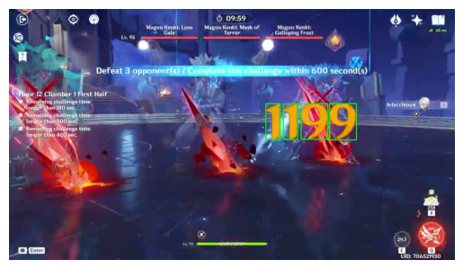
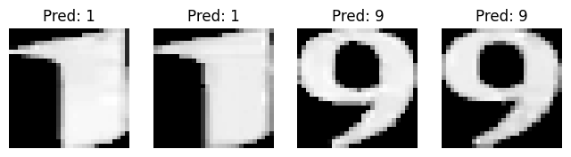

# Genshin Impact video game - Number Prediction Neural Network

This project implements a neural network model to predict digits using deep learning techniques. The model is trained on a dataset of numbers and can predict digits from 0-9.

## Project Overview

The neural network is designed to:
- Take video digit and convert into images as input
- Process them through convolutional layers
- Output predictions for the digit classification (0-9)

## Results

The model's predictions are visualized in two output files:
- `OUTPUT_END_result_pred.png`: Shows the model's predictions alongside the input images
- `OUTPUT_END_result.png`: Displays the original test images

### Original Test Images

### Prediction Results

As shown in the prediction results:
- The model successfully identifies digits like "1" and "9" with high confidence
- The predictions are displayed above each image (e.g., "Pred: 1", "Pred: 9")

## Model Architecture

The neural network likely uses:
- Convolutional Neural Network (CNN) layers for feature extraction
- Max pooling layers for dimensionality reduction
- Dense layers for final classification
- Softmax activation for output probabilities

## Training Process

The model was trained using:
1. Image preprocessing and normalization
2. Data augmentation techniques
3. Gradient descent optimization
4. Cross-entropy loss function
5. Multiple epochs to improve accuracy

